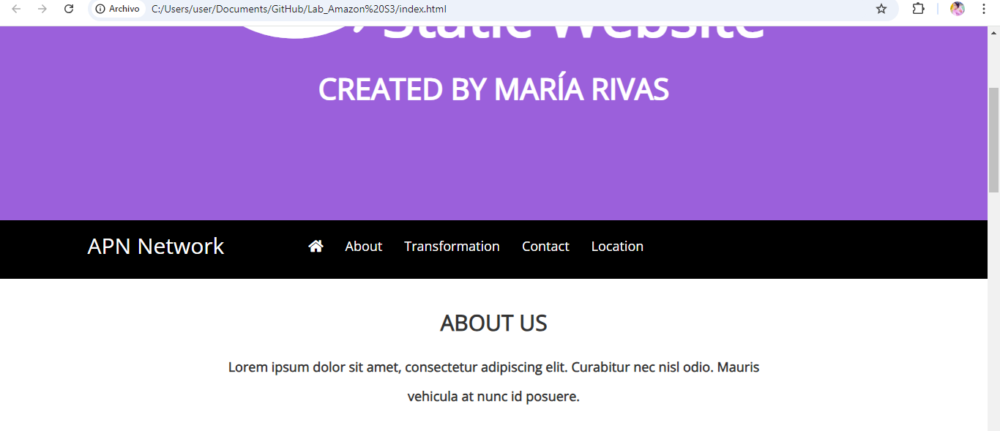

# Laboratorio: Introducción a Amazon S3

Durante este laboratorio, tuve la oportunidad de trabajar con **Amazon S3**, el servicio de almacenamiento en la nube de AWS, lo cual me permitió familiarizarme con su funcionamiento y potencial. A continuación, te cuento el paso a paso de lo que realicé:

## Creación de un bucket en Amazon S3
Primero, aprendí a **crear un bucket** en S3, que es el contenedor donde se almacenan los archivos o "objetos". Tuve que escoger un nombre único globalmente y seleccioné la región más cercana para optimizar el rendimiento y costos. Fue interesante ver cómo se debe ser cuidadoso con los nombres, ya que estos deben cumplir ciertos requisitos.

## Carga y gestión de objetos
Una vez que tuve mi bucket creado, lo siguiente fue **subir archivos**. Pude cargar varios tipos de archivos, como imágenes y un archivo HTML para mi aplicación web. Desde la consola de AWS, fue sencillo arrastrar los archivos y gestionar versiones. Me di cuenta de lo práctico que es S3 para almacenar cualquier tipo de datos, sin importar el tamaño.

## Configuración de permisos y políticas
Luego, configuré los **permisos** de los archivos que subí. Utilicé las políticas de acceso de Amazon S3 para controlar quién podía ver o descargar los archivos. Esto fue clave, ya que me permitió experimentar con los **roles de IAM** y aprender cómo proteger los datos almacenados.

## Publicación de un sitio web estático
Una de las partes más interesantes del laboratorio fue **publicar un sitio web estático** directamente desde S3. Subí un archivo HTML y configuré el bucket para que funcionara como un hosting de sitio web. Configuré las opciones del bucket para que los archivos HTML, CSS y JavaScript se sirvieran correctamente como un sitio web. Fue sorprendente lo fácil que es usar S3 para este propósito, sin necesidad de configurar un servidor.

## Implementación de versionado
También habilité el **versionado** en el bucket, lo que me permitió gestionar varias versiones de los archivos que subí. De esta forma, pude recuperar archivos anteriores en caso de que accidentalmente los modificara o borrara. Este fue un paso muy útil para mantener un control de las versiones del sitio web.

## Monitoreo y control de costos
Por último, revisé cómo funciona el modelo de precios de S3 y aprendí a elegir entre las diferentes **clases de almacenamiento** según las necesidades del proyecto. Me enfoqué en cómo S3 optimiza costos dependiendo de la frecuencia de acceso a los datos, usando desde almacenamiento estándar hasta opciones como **S3 Glacier** para archivos que no necesitan acceso frecuente.

## Reflexión final
Este laboratorio me permitió comprender de primera mano cómo **Amazon S3** no solo facilita el almacenamiento masivo y seguro de datos, sino también cómo se puede utilizar para tareas tan variadas como el hosting de un sitio web estático. A partir de este ejercicio, me siento más cómoda gestionando datos en la nube y utilizando herramientas como IAM para controlar el acceso, todo con un enfoque en la seguridad y la eficiencia.

## Derechos de Autor

Este laboratorio se llevó a cabo como parte de los contenidos educativos proporcionados por la plataforma **AWS Educate**. Todos los derechos y materiales utilizados pertenecen a **Amazon Web Services (AWS)** y están sujetos a sus políticas y términos de uso.

Este proyecto y la documentación asociada son solo con fines educativos y no están destinados para su uso comercial o distribución.

